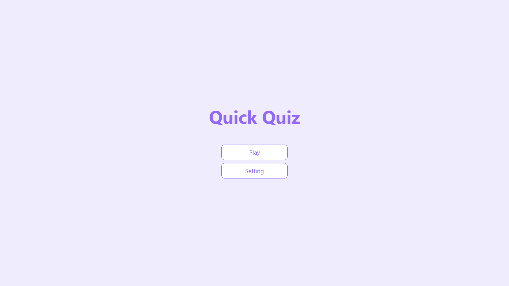
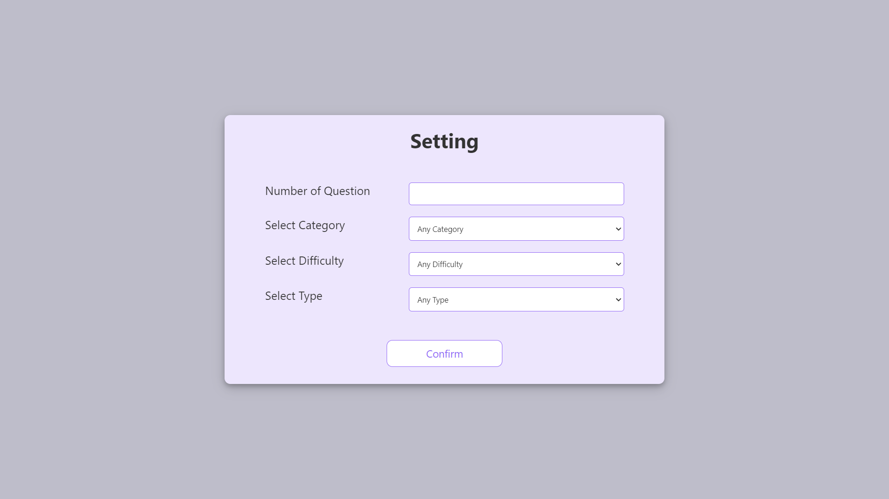

# Quiz app

##  Built with HTML, CSS, and JavaScript

This is the project where I code along with the tutorial - [Build a Quiz App with HTML, CSS, and JavaScript](https://www.youtube.com/playlist?list=PLB6wlEeCDJ5Yyh6P2N6Q_9JijB6v4UejF).

After completed the project, I have implement some other features: 

- By default, users will get a random catogeries of 10 questions without setting the quiz option.
- Users can set a maximum number of 50 questions, the catogory and the difficulty for the quiz.
- Users can set a the question types including multiple choice or true-false.
- Users can see the quiz result and review answers after finishing the quiz.
- A smooth animation when switching the 'page' to another question. 

 
 

